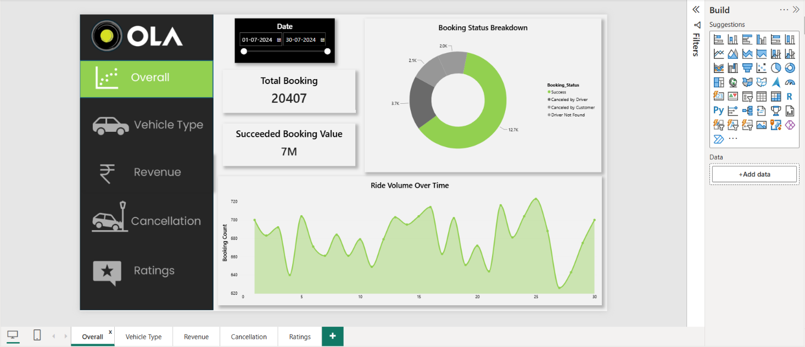
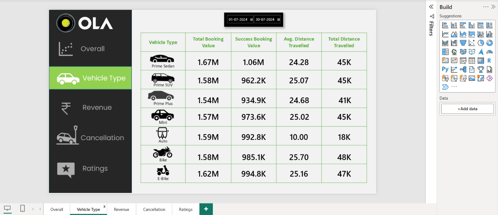
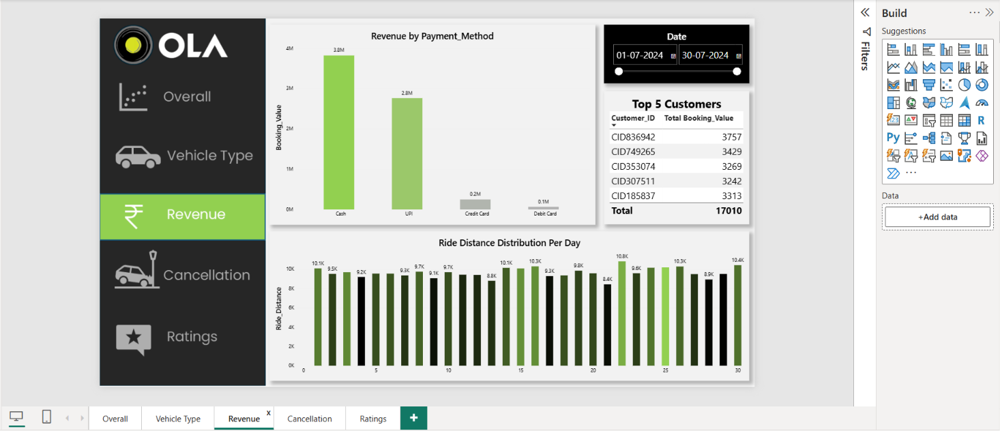
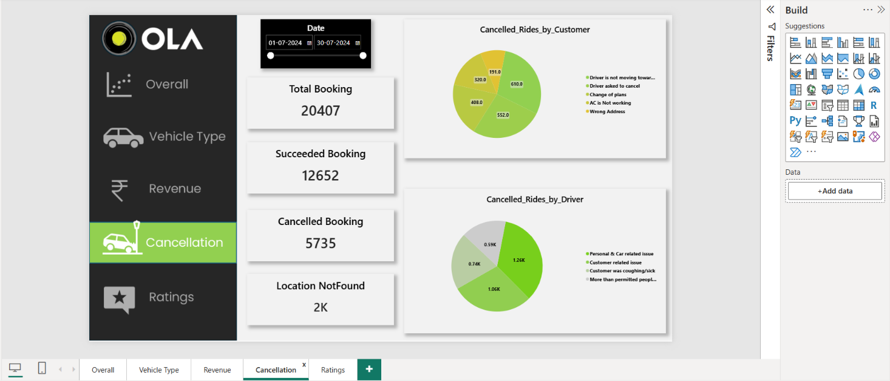
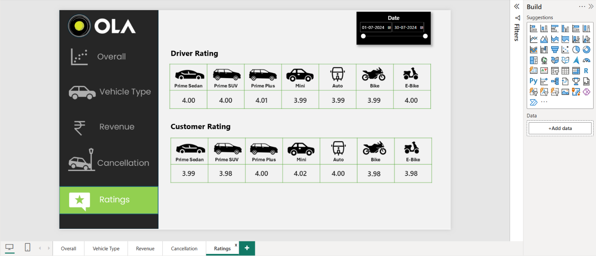

# OLA Data Analytics Dashboard

## 📊 Project Overview
This project is a comprehensive data analytics dashboard built using **Power BI** for OLA ride bookings. It provides insights into:
- **Overall Performance**: Total bookings, revenue, cancellation rates, and ratings.
- **Vehicle Type Analysis**: Performance metrics for Prime Sedan, Prime SUV, Prime Plus, Mini, Auto, Bike, and E-Bike.
- **Revenue Analysis**: Revenue breakdown by payment method and top customers.
- **Cancellation Insights**: Reasons for cancellations by drivers and customers.
- **Ratings**: Driver and customer ratings across vehicle types.

## 🗓️ Data Period
- **Start Date**: 01-07-2026  
- **End Date**: 30-07-2026

## 📈 Key Metrics
- **Total Bookings**: 20,407
- **Succeeded Bookings**: 12,652
- **Cancelled Bookings**: 5,735
- **Total Revenue (Succeeded)**: 7M

## 🛠️ Tools Used
- **Power BI Desktop** – for data visualization and dashboard creation.
- **Data Source**: Simulated booking data (CSV format).

## 📂 Folder Structure
- `/data` – Raw data files (if applicable).
- `/dashboard` – Power BI `.pbix` file.
- `/screenshots` – PNG images of each dashboard tab.

## 🚀 How to View the Dashboard
1. Download and install [Power BI Desktop](https://powerbi.microsoft.com/desktop/).
2. Clone this repository.
3. Open the `OLA_Dashboard.pbix` file from the `/dashboard` folder.
4. Explore the tabs: Overall, Vehicle Type, Revenue, Cancellation, and Ratings.

## 📸 Dashboard Preview

## 🤝 Contributing
Contributions are welcome. Feel free to fork the repo and submit pull requests.

## 📬 Contact
For any queries, please reach out via GitHub Issues.

MUKESH KUMAR JHA

---

**Happy Analyzing! 🚀**
